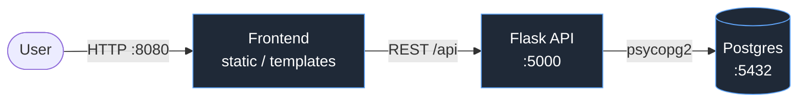

# baseline-LLMOps

```mermaid
flowchart LR
    User([User])
    Web[Frontend<br/>static / templates]
    API[Flask API<br/>:5000]
    DB[(Postgres<br/>:5432)]

    User -->|HTTP :8080| Web
    Web -->|REST /api| API
    API -->|psycopg2| DB

    classDef tier fill:#1f2937,stroke:#60a5fa,color:#fff
    class Web,API,DB tier
```