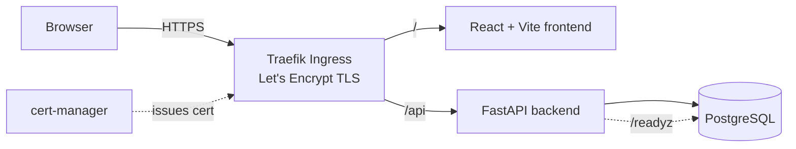
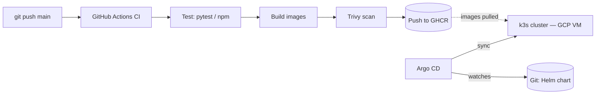

# baseline-LLMOps — a self-deploying platform


 [](https://artaoheed.duckdns.org)

> A personal internal platform that **builds, tests, scans, and deploys itself**. One small 3-tier app evolving level by level — from "containerized with Compose" toward "operate an LLM service" — as a hands-on DevOps → MLOps → LLMOps portfolio.

Every push to `main` runs CI (test → build → vulnerability scan → publish image), and **Argo CD reconciles the cluster to Git automatically**. No manual `kubectl apply`, no `helm upgrade` — change the code, push, and the platform updates itself.

**🔴 Live:** [https://artaoheed.duckdns.org](https://artaoheed.duckdns.org) — running on a real cloud VM (GCP, `us-central1`), not a local cluster.

---

---

## What it is

A minimal 3-tier web app used as the *vehicle* for platform engineering practice — the app is deliberately simple so the **operations** can be the star:

- **Frontend** — React + Vite
- **Backend** — FastAPI (Python)
- **Database** — PostgreSQL

The interesting part isn't the app; it's the delivery pipeline, the Kubernetes packaging, the security gate, and the GitOps loop wrapped around it.

---

## Architecture



The backend exposes a `/readyz` readiness probe that verifies it can actually reach Postgres before Kubernetes routes traffic to it. In production, **Traefik Ingress** terminates TLS using a certificate auto-issued and renewed by **cert-manager** via Let's Encrypt, routing `/` to the frontend and `/api` to the backend on the same domain.

---

## How a change flows from commit to cluster



1. **Push to `main`** triggers GitHub Actions.
2. CI **tests** both services, **builds** images, **scans** them with Trivy, and **pushes** to GitHub Container Registry (GHCR).
3. **Argo CD** continuously watches the Helm chart in this repo.
4. On any change, Argo CD **syncs** the cluster to match Git — pulling the freshly published images and applying the desired state. As of Phase 3, this cluster is a real **k3s node running on a GCP VM**, not a local dev cluster.

The result: Git is the single source of truth, and the cluster self-heals back to it.

---

## Tech stack

| Layer | Tools |
|---|---|
| App | React + Vite, FastAPI, PostgreSQL |
| Containers | Docker, Docker Compose |
| Orchestration | Kubernetes (k3s), Helm |
| Infrastructure | Terraform (GCP) |
| CI | GitHub Actions |
| Security | Trivy (image vulnerability scanning) |
| Registry | GitHub Container Registry (GHCR) |
| GitOps / CD | Argo CD |
| TLS / Certificates | cert-manager + Let's Encrypt |
| DNS | DuckDNS |
| Environment | WSL Ubuntu |

---

## Repository structure

Replace with:
```markdown
baseline-LLMOps/
├── .github/workflows/ci.yml      # CI: test → build → Trivy scan → push to GHCR
├── argocd/application.yaml        # Argo CD Application (declarative GitOps)
├── infra/                         # Terraform — GCP VPC, firewall, k3s VM
│   ├── main.tf
│   ├── network.tf
│   ├── compute.tf
│   ├── variables.tf
│   └── outputs.tf
├── starter/
│   ├── backend/                   # FastAPI service + Dockerfile
│   ├── frontend/                  # React + Vite service + Dockerfile
│   └── platform/                  # Helm chart (the whole app), incl. Ingress + TLS
└── README.md
```

---

## Run it locally

**Option A — Docker Compose (fastest):**

```bash
cd starter
docker compose up --build
```

**Option B — Kubernetes + GitOps (local dev cluster, mirrors the cloud setup):**

```bash
# 1. Local cluster
kind create cluster --name flask-platform

# 2. Install Argo CD
kubectl create namespace argocd
kubectl apply -n argocd -f https://raw.githubusercontent.com/argoproj/argo-cd/stable/manifests/install.yaml

# 3. Register the app — Argo CD takes it from here
kubectl apply -f argocd/application.yaml

# 4. Open the Argo CD UI
kubectl port-forward svc/argocd-server -n argocd 8080:443
# then visit https://localhost:8080
```

Argo CD pulls the public images from GHCR and brings the platform up to `Synced / Healthy`.

---

## Progress & achievements

The platform grows one level per phase. **Phases 0–2 are complete.**

### ✅ Phase 0 — Containerize & ship
Three-tier app containerized and wired together with Docker Compose; runs with a single command. Public repo with README.

### ✅ Phase 1 — Local Kubernetes + Helm
Moved onto a real (local) Kubernetes cluster (kind). Wrote Deployments, Services, ConfigMaps + Secrets, resource requests/limits, and liveness/readiness probes — including a `/readyz` endpoint that validates Postgres connectivity. Packaged the whole thing as a **Helm chart**.

### ✅ Phase 2 — CI/CD + GitOps + security
- **CI pipeline** (GitHub Actions): on every push → test both services → build images → **Trivy** vulnerability scan → publish to **GHCR**.
- Images published publicly: `ghcr.io/artaoheed/platform-backend`, `ghcr.io/artaoheed/platform-frontend`.
- **Argo CD** installed on the cluster with a declarative `Application` watching the Helm chart — **`Synced / Healthy`**.
- **Push-to-main auto-sync verified**: a committed change deploys itself with no manual steps.

> _Argo CD dashboard — platform app Synced / Healthy:_
>
> 
> <!-- Save your Argo CD screenshot to docs/argocd-synced.png and it renders here -->

### ✅ Phase 3 — Real cloud infrastructure + public HTTPS
- **Infrastructure as Code**: VPC, subnet, firewall rules, and a GCE VM provisioned entirely via **Terraform** (`infra/`), on Google Cloud (`us-central1`).
- **k3s** installed directly on the VM — a real, internet-facing Kubernetes node, not a local dev cluster.
- **Argo CD redeployed on the cloud cluster**, watching the same Helm chart, same GitOps loop as Phase 2 — now reconciling a production-like environment instead of `kind`.
- **cert-manager + Let's Encrypt**: TLS certificates issued and renewed automatically via the ACME HTTP-01 challenge.
- **Traefik Ingress** routes a single public domain to both services: `/` → frontend, `/api` → backend.
- **Public HTTPS endpoint**: [artaoheed.duckdns.org](https://artaoheed.duckdns.org), backed by a real, trusted certificate — no browser warnings.

> _Live application served over HTTPS with a valid Let's Encrypt certificate:_
>
> 
> <!-- Save a screenshot of the browser padlock + app to docs/phase3-https-live.png -->

---

## Roadmap
---

## Roadmap

| Phase | Focus | Status |
|---|---|---|
| 0 | Containerize & ship (Compose) | ✅ Done |
| 1 | Local Kubernetes + Helm | ✅ Done |
| 2 | CI/CD + GitOps + security | ✅ Done |
| 2.5 | Ingress + Postgres PVC (GitOps-style) | ✅ Done |
| 3 | Real cloud infrastructure (Terraform + GCP) + public HTTPS | ✅ Done |
| 4 | Observability + reliability (Prometheus / Grafana / Loki, chaos + runbooks) | ⬜ Planned |
| 5 | MLOps: serve & monitor a model (MLflow + Evidently) | ⬜ Planned |
| 6 | LLMOps capstone: operate a RAG/LLM service | ⬜ Planned |

---

## Engineering notes (decisions & lessons)

- **GitOps over imperative deploys.** The cluster is reconciled to Git, not changed by hand — so the repo is the source of truth and drift self-heals.
- **Security shifted left.** Vulnerability scanning runs in CI on every image, before anything reaches the cluster.
- **Pinned third-party actions.** After the March 2026 trivy-action supply-chain incident, the scanner is pinned to a known-good release (`v0.36.0`) — a reminder to pin/verify external CI dependencies.
- **Probes that mean something.** Readiness is tied to real Postgres connectivity (`/readyz`), so Kubernetes only sends traffic to pods that can actually serve it.

---

_Built as part of a structured 6-month DevOps + MLOps portfolio program. Follow along — each phase ships something public._
## Traffic flow

**Local (kind, Phase 2.5):** Browser → `http://platform.localtest.me:8080` → ingress-nginx controller (port-forwarded) → Ingress resource → `frontend` svc (UI) / `flask-app` svc (API at `/api`)

**Production (k3s on GCP, Phase 3):** Browser → `https://artaoheed.duckdns.org` → Traefik Ingress (TLS terminated, cert from cert-manager/Let's Encrypt) → `frontend` svc (`/`) / `flask-app` svc (`/api`)
