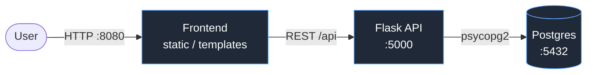

# 3-Tier Starter Platform

> Phase 0 of my DevOps/MLOps portfolio. The platform grows one level per phase.

A containerized 3-tier app: **React** frontend → **FastAPI** API → **Postgres** database.

## Run it (one command)

```bash
docker compose up --build
```

- Frontend: http://localhost:5173
- API: http://localhost:8000 (health: `/healthz`, data: `/api/notes`)

`docker compose down` to stop. `docker compose down -v` to also wipe the DB volume.

## Architecture


## What's next

- [ ] Architecture diagram in README
- [ ] Phase 1: move onto local Kubernetes (kind/k3s) + Helm chart
